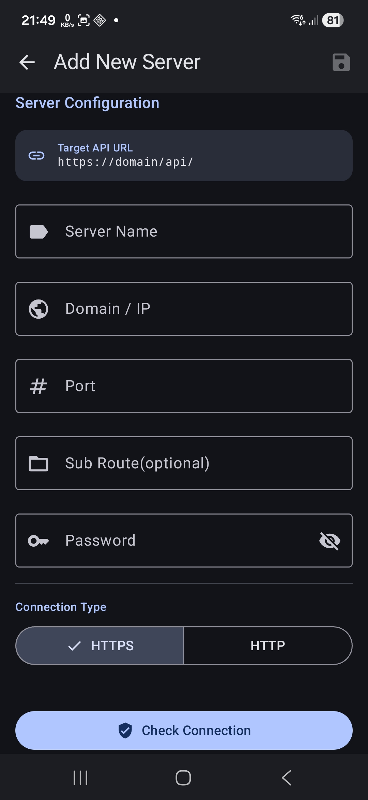

# 📱 PiHoleMonitor – User Guide

This manual assists you in setting up and using the **PiHoleMonitor** app. PiHoleMonitor is an unofficial client for **Pi-hole®**, allowing you to conveniently monitor and manage your ad-filtering instances through a native interface built with Jetpack Compose.

---

### 📖 Table of Contents
* [1. Security & Privacy](#1-security--privacy)
* [2. Server Configuration](#2-server-configuration)
* [3. Dashboard](#3-dashboard)
* [4. Management](#4-management)
* [5. Query Logs](#5-query-logs)
* [6. System](#6-system)
* [7. Settings](#7-settings)

---

## 🛡️ 1. Security & Privacy
Since the app interacts with your network infrastructure, data protection is our highest priority.

* **Encryption**: Sensitive data such as passwords and session IDs are never stored in plain text. The app utilizes **AES-GCM encryption** within the hardware-backed **Android KeyStore**.
* **Authentication**: Communication follows the official API protocol using secure session IDs (`sid`) and CSRF tokens.
* **Locality**: PiHoleMonitor is "Offline-First". **No data is transmitted** to external cloud servers owned by the developer. All connections occur directly between your smartphone and your Pi-hole instance.
* **Biometrics**: You can optionally protect app access using your fingerprint, facial recognition, or PIN.

---

## ⚙️ 2. Server Configuration
To use the app, you must register your Pi-hole instance (API v6+ supported).

* **Server Name**: A freely definable name for identification within the app.
* **Domain / IP**: The address of your instance (e.g., `192.168.178.5`).
* **Port**: The web interface port (Default: `80` for HTTP or `443` for HTTPS).
* **Sub Route (Optional)**:
    > 💡 **Nginx / Reverse-Proxy**: If your Pi-hole is reachable via a sub-path like `domain.com/pihole`, enter `/pihole` here. The app automatically appends the required `/api/` suffix internally.
* **Password**: Your Pi-hole web interface password.
* **Connection Type**: Choose between **HTTPS** (recommended) or **HTTP**.

### Connection Test & Saving
* **Check Connection**: Performs a test request to validate reachability and password correctness.
* **Save (Disk Icon)**: Commits the data to encrypted storage. Upon initial setup, this server is automatically marked as the active instance.

---

## 📊 3. Dashboard
The Dashboard provides a real-time overview of your network health.

* **24h History**: Track DNS queries over the last 24 hours in a detailed graph.
* **Total Statistics**: Summary of total queries, blocked requests, and the current block rate.
* **Client Ranking**: Identify the most active clients in your network.

---

## 🗂️ 4. Management
Manage your Pi-hole configuration directly within the app.

* **Clients**: View, create, and edit network clients.
* **Ad-lists (Gravity)**: Manage your blocklist sources used for filtering advertisements.
* **Domains**: Maintain whitelists and blacklists (exact or regex-based).
* **Groups**: Organize clients and lists into logical groups.

---

## 🔍 5. Query Logs
Deep insights into your network's DNS traffic.

* **Status Filter**: Filter specifically for allowed, blocked, or cached queries.
* **Search**: Search for specific domains or client IP addresses.

---

## 💻 6. System
Hardware and network environment monitoring.

* **Host System**: Displays host information, CPU load, RAM usage, and the `pihole-FTL` process status.
* **Pi-hole**: Enable/disable the DNS filter, monitor DNS cache utilization, execute Pi-hole actions, and view system notifications.
* **Network**: Detailed overview of gateways, interfaces, and routes.
* **DHCP**: Management of active DHCP leases.

### Available Actions:
* **FTL Restart**: Restarts the DNS service on your instance.
* **Gravity Update**: Triggers a blocklist update.
* **Flush Logs/ARP**: Clears DNS query logs or flushes the network table.

> [!CAUTION]
> **Warning**: Executing Pi-hole actions like restarting FTL or updating Gravity will cause a brief interruption of DNS resolution for your entire network.
> 
> **Flush Logs & ARP**: These actions permanently delete all query logs and clear the list of known network devices (network table).

---

## 🛠️ 7. Settings
Personalize your PiHoleMonitor experience.

* **Theme & Language**: Toggle between Dark/Light mode and select your preferred system language.
* **Notifications**: Configure system-level alerts.
* **Widgets**: Customize the appearance of your home screen widgets.
* **Security**: Configure biometric login settings.
* **Maintenance**: Enable or disable crash reporting.
* **Debug Log Recorder**: Utilize the log recorder to assist in troubleshooting issues.
