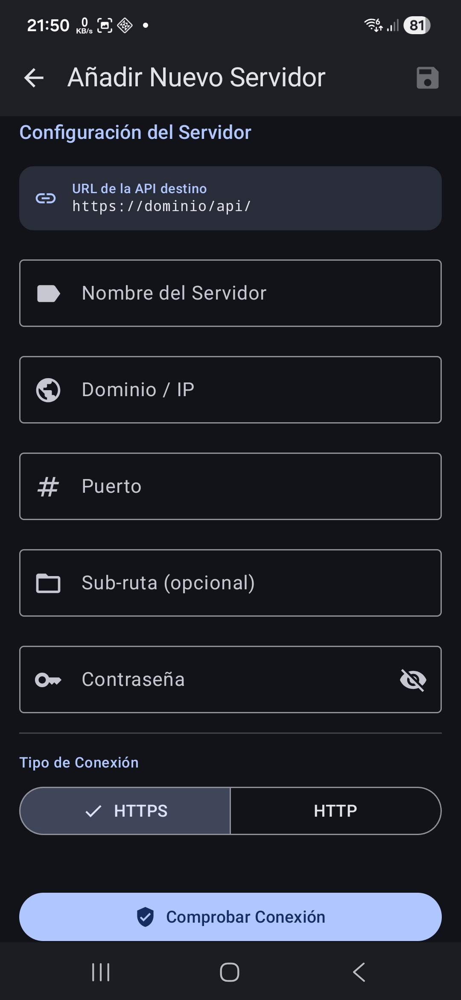

# 📱 PiHoleMonitor – Guía del usuario

Este manual le ayuda a configurar y utilizar la aplicación **PiHoleMonitor**. PiHoleMonitor es un cliente no oficial para **Pi-hole®**, que le permite supervisar y gestionar cómodamente sus instancias de filtrado de anuncios a través de una interfaz nativa creada con Jetpack Compose.

---

### 📖 Tabla de contenidos
* [1. Seguridad y privacidad](#1-seguridad--privacidad)
* [2. Configuración del servidor](#2-configuración-del-servidor)
* [3. Panel de control (Dashboard)](#3-panel-de-control-dashboard)
* [4. Gestión](#4-gestión)
* [5. Registros de consultas](#5-registros-de-consultas)
* [6. Sistema](#6-sistema)
* [7. Ajustes](#7-ajustes)

---

## 🛡️ 1. Seguridad y privacidad
Dado que la aplicación interactúa con su infraestructura de red, la protección de datos es nuestra máxima prioridad.

* **Cifrado**: Los datos sensibles, como las contraseñas y los ID de sesión, nunca se almacenan en texto plano. La aplicación utiliza el **cifrado AES-GCM** dentro del **Android KeyStore** respaldado por hardware.
* **Autenticación**: La comunicación sigue el protocolo oficial de la API mediante ID de sesión seguros (`sid`) y tokens CSRF.
* **Localidad**: PiHoleMonitor es "Offline-First". **No se transmiten datos** a servidores en la nube externos propiedad del desarrollador. Todas las conexiones se producen directamente entre su smartphone y su instancia de Pi-hole.
* **Biometría**: Opcionalmente, puede proteger el acceso a la aplicación mediante su huella dactilar, reconocimiento facial o PIN.

---

## ⚙️ 2. Configuración del servidor
Para utilizar la aplicación, debe registrar su instancia de Pi-hole (compatible con API v6+).

* **Nombre del servidor**: Un nombre definible libremente para su identificación dentro de la aplicación.
* **Dominio / IP**: La dirección de su instancia (p. ej., `192.168.178.5`).
* **Puerto**: El puerto de la interfaz web (Predeterminado: `80` para HTTP o `443` para HTTPS).
* **Subruta (Opcional)**:
    > 💡 **Nginx / Reverse-Proxy**: Si su Pi-hole es accesible a través de una subruta como `dominio.com/pihole`, introduzca `/pihole` aquí. La aplicación añade automáticamente el sufijo `/api/` necesario internamente.
* **Contraseña**: La contraseña de su interfaz web de Pi-hole.
* **Tipo de conexión**: Elija entre **HTTPS** (recomendado) o **HTTP**.

### Prueba de conexión y guardado
* **Comprobar conexión**: Realiza una solicitud de prueba para validar la accesibilidad y la corrección de la contraseña.
* **Guardar (Icono de disco)**: Guarda los datos en el almacenamiento cifrado. En la configuración inicial, este servidor se marca automáticamente como la instancia activa.

---

## 📊 3. Panel de control (Dashboard)
El panel de control ofrece una visión general en tiempo real del estado de su red.

* **Historial de 24h**: Realice un seguimiento de las consultas DNS de las últimas 24 horas en un gráfico detallado.
* **Estadísticas totales**: Resumen del total de consultas, solicitudes bloqueadas y la tasa de bloqueo actual.
* **Ranking de clientes**: Identifique los clientes más activos de su red.

---

## 🗂️ 4. Gestión
Gestione la configuración de su Pi-hole directamente en la aplicación.

* **Clientes**: Vea, cree y edite clientes de red.
* **Listas de anuncios (Gravity)**: Gestione sus fuentes de listas de bloqueo utilizadas para filtrar anuncios.
* **Dominios**: Mantenga listas blancas y negras (exactas o basadas en regex).
* **Grupos**: Organice clientes y listas en grupos lógicos.

---

## 🔍 5. Registros de consultas
Información detallada sobre el tráfico DNS de su red.

* **Filtro de estado**: Filtre específicamente por consultas permitidas, bloqueadas o en caché.
* **Búsqueda**: Busque dominios específicos o direcciones IP de clientes.

---

## 💻 6. Sistema
Supervisión del hardware y del entorno de red.

* **Sistema anfitrión**: Muestra información del host, carga de la CPU, uso de RAM y el estado del proceso `pihole-FTL`.
* **Pi-hole**: Active/desactive el filtro DNS, supervise el uso de la caché DNS, ejecute acciones de Pi-hole y vea las notificaciones del sistema.
* **Red**: Resumen detallado de puertas de enlace, interfaces y rutas.
* **DHCP**: Gestión de las concesiones DHCP activas.

### Acciones disponibles:
* **Reiniciar FTL**: Reinicia el servicio DNS en su instancia.
* **Actualización de Gravity**: Activa una actualización de la lista de bloqueo.
* **Vaciar registros/ARP**: Borra los registros de consultas DNS o vacía la tabla de red.

> [!CAUTION]
> **Advertencia**: La ejecución de acciones de Pi-hole como reiniciar FTL o actualizar Gravity causará una breve interrupción de la resolución DNS para toda su red.
> 
> **Vaciar registros y ARP**: Estas acciones eliminan permanentemente todos los registros de consultas y borran la lista de dispositivos de red conocidos (tabla de red).

---

## 🛠️ 7. Ajustes
Personalice su experiencia con PiHoleMonitor.

* **Tema e idioma**: Cambie entre el modo oscuro/claro y seleccione su idioma de sistema preferido.
* **Notificaciones**: Configure las alertas a nivel de sistema.
* **Widgets**: Personalice la apariencia de los widgets de su pantalla de inicio.
* **Seguridad**: Configure los ajustes de inicio de sesión biométrico.
* **Mantenimiento**: Active o desactive el envío de informes de errores.
* **Grabador de registros de depuración**: Utilice el grabador de registros para ayudar en la resolución de problemas.
