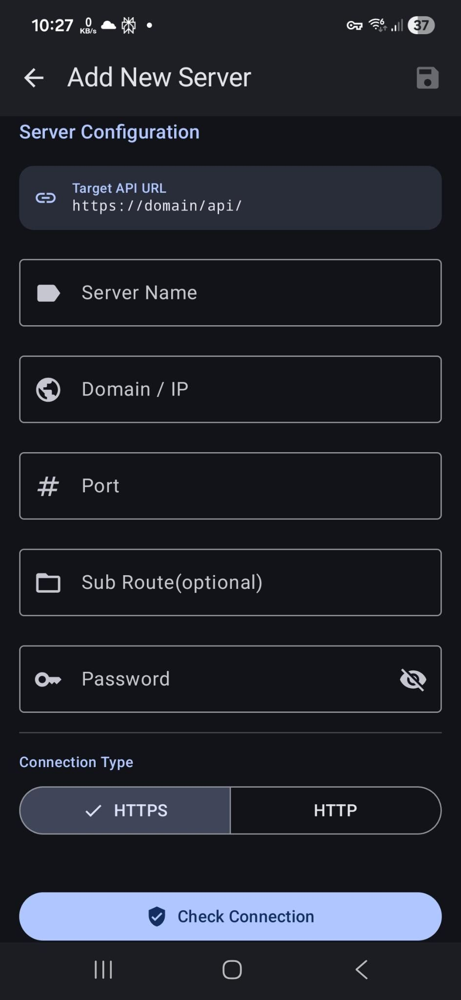

# 📱 PiHoleMonitor – Instrukcja obsługi

Niniejsza instrukcja pomaga w konfiguracji i obsłudze aplikacji **PiHoleMonitor**. PiHoleMonitor to nieoficjalny klient dla **Pi-hole®**, pozwalający na wygodne monitorowanie i zarządzanie instancjami filtrującymi reklamy poprzez natywny interfejs zbudowany w Jetpack Compose.

---

### 📖 Spis treści
* [1. Bezpieczeństwo i prywatność](#1-bezpieczeństwo-i-prywatność)
* [2. Konfiguracja serwera](#2-konfiguracja-serwera)
* [3. Pulpit nawigacyjny (Dashboard)](#3-pulpit-nawigacyjny-dashboard)
* [4. Zarządzanie](#4-zarządzanie)
* [5. Dzienniki zapytań](#5-dzienniki-zapytań)
* [6. System](#6-system)
* [7. Ustawienia](#7-ustawienia)

---

## 🛡️ 1. Bezpieczeństwo i prywatność
Ponieważ aplikacja wchodzi w interakcję z infrastrukturą sieciową, ochrona danych jest naszym najwyższym priorytetem.

* **Szyfrowanie**: Wrażliwe dane, takie jak hasła i identyfikatory sesji, nigdy nie są przechowywane w postaci otwartego tekstu. Aplikacja wykorzystuje **szyfrowanie AES-GCM** w ramach sprzętowo zabezpieczonego **Android KeyStore**.
* **Uwierzytelnianie**: Komunikacja odbywa się zgodnie z oficjalnym protokołem API przy użyciu bezpiecznych identyfikatorów sesji (`sid`) i tokenów CSRF.
* **Lokalność**: PiHoleMonitor działa w trybie „Offline-First”. **Żadne dane nie są przesyłane** do zewnętrznych serwerów w chmurze należących do dewelopera. Wszystkie połączenia odbywają się bezpośrednio między smartfonem a instancją Pi-hole.
* **Biometria**: Opcjonalnie możesz zabezpieczyć dostęp do aplikacji za pomocą odcisku palca, rozpoznawania twarzy lub kodu PIN.

---

## ⚙️ 2. Konfiguracja serwera
Aby korzystać z aplikacji, musisz zarejestrować swoją instancję Pi-hole (obsługiwane API v6+).

* **Nazwa serwera**: Dowolna nazwa ułatwiająca identyfikację w aplikacji.
* **Domena / IP**: Adres Twojej instancji (np. `192.168.178.5`).
* **Port**: Port interfejsu webowego (Domyślnie: `80` dla HTTP lub `443` dla HTTPS).
* **Ścieżka podrzędna (Opcjonalnie)**:
    > 💡 **Nginx / Reverse-Proxy**: Jeśli Twoje Pi-hole jest dostępne pod adresem typu `domena.com/pihole`, wpisz tutaj `/pihole`. Aplikacja automatycznie doda wewnętrznie wymagany sufiks `/api/`.
* **Hasło**: Twoje hasło do interfejsu webowego Pi-hole.
* **Typ połączenia**: Wybierz pomiędzy **HTTPS** (zalecane) a **HTTP**.

### Test połączenia i zapisywanie
* **Sprawdź połączenie**: Wykonuje zapytanie testowe w celu sprawdzenia dostępności i poprawności hasła.
* **Zapisz (Ikona dyskietki)**: Zapisuje dane w zaszyfrowanej pamięci. Przy pierwszej konfiguracji serwer ten zostanie automatycznie ustawiony jako aktywna instancja.

---

## 📊 3. Pulpit nawigacyjny (Dashboard)
Pulpit nawigacyjny zapewnia podgląd stanu sieci w czasie rzeczywistym.

* **Historia 24h**: Śledź zapytania DNS z ostatnich 24 godzin na szczegółowym wykresie.
* **Statystyki ogólne**: Podsumowanie całkowitej liczby zapytań, zablokowanych żądań i aktualnego współczynnika blokowania.
* **Ranking klientów**: Zidentyfikuj najaktywniejszych klientów w swojej sieci.

---

## 🗂️ 4. Zarządzanie
Zarządzaj konfiguracją Pi-hole bezpośrednio w aplikacji.

* **Klienci**: Przeglądaj, twórz i edytuj klientów sieciowych.
* **Listy reklam (Gravity)**: Zarządzaj źródłami list blokowania używanymi do filtrowania reklam.
* **Domeny**: Zarządzaj białymi i czarnymi listami (dokładnymi lub opartymi na wyrażeniach regularnych).
* **Grupy**: Organizuj klientów i listy w logiczne grupy.

---

## 🔍 5. Dzienniki zapytań
Głęboki wgląd w ruch DNS w Twojej sieci.

* **Filtr statusu**: Filtruj konkretnie zapytania dozwolone, zablokowane lub pobrane z pamięci podręcznej.
* **Szukaj**: Wyszukuj konkretne domeny lub adresy IP klientów.

---

## 💻 6. System
Monitorowanie sprzętu i środowiska sieciowego.

* **System gospodarza**: Wyświetla informacje o hoście, obciążenie procesora, zużycie pamięci RAM oraz status procesu `pihole-FTL`.
* **Pi-hole**: Włączaj/wyłączaj filtr DNS, monitoruj wykorzystanie pamięci podręcznej DNS, wykonuj akcje Pi-hole i przeglądaj powiadomienia systemowe.
* **Sieć**: Szczegółowy przegląd bramek, interfejsów i tras.
* **DHCP**: Zarządzanie aktywnymi dzierżawami DHCP.

### Dostępne akcje:
* **Restart FTL**: Restartuje usługę DNS na Twojej instancji.
* **Aktualizacja Gravity**: Uruchamia aktualizację list blokowania.
* **Czyszczenie logów/ARP**: Czyści dzienniki zapytań DNS lub czyści tabelę sieciową.

> [!CAUTION]
> **Ostrzeżenie**: Wykonanie akcji Pi-hole, takich jak restart FTL lub aktualizacja Gravity, spowoduje krótką przerwę w rozwiązywaniu nazw DNS dla całej sieci.
> 
> **Czyszczenie logów i ARP**: Te akcje trwale usuwają wszystkie dzienniki zapytań i czyszczą listę znanych urządzeń sieciowych (tabelę sieciową).

---

## 🛠️ 7. Ustawienia
Spersonalizuj swoje wrażenia z PiHoleMonitor.

* **Motyw i język**: Przełączaj między trybem ciemnym/jasnym i wybierz preferowany język systemu.
* **Powiadomienia**: Konfiguruj alerty na poziomie systemu.
* **Widżety**: Dostosuj wygląd widżetów na ekranie głównym.
* **Bezpieczeństwo**: Konfiguruj ustawienia logowania biometrycznego.
* **Konserwacja**: Włącz lub wyłącz raportowanie awarii.
* **Rejestrator logów debugowania**: Skorzystaj z rejestratora logów, aby pomóc w rozwiązywaniu problemów.
